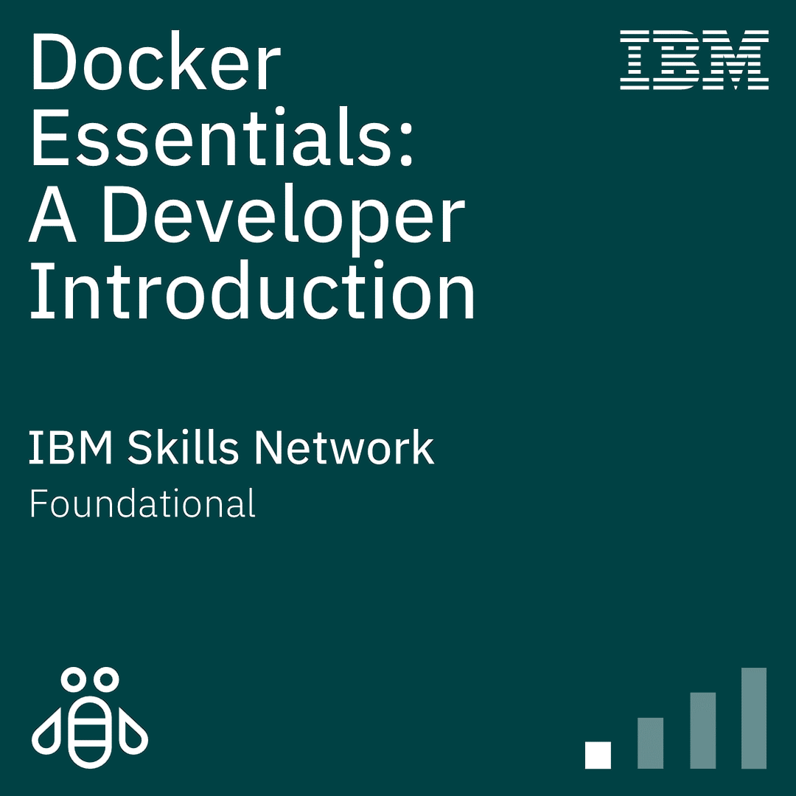

# 🐳 Docker Essentials: PHP/MySQL Development Environment

## Contexto do Projeto
Este repositório contém o projeto prático desenvolvido para consolidar os conhecimentos adquiridos no curso **Docker Essentials: A Developer Introduction**. 

O objetivo deste projeto é resolver um problema clássico de desenvolvimento de software, a famosa frase "na minha máquina funciona", através da criação de um ambiente de desenvolvimento local padronizado, isolado e reprodutível para uma aplicação web baseada em PHP e MySQL.

## Arquitetura e Conceitos Aplicados

Neste projeto, apliquei conceitos fundamentais de containerização e orquestração para criar uma infraestrutura que pode ser levantada com um único comando:

### 1. Orquestração Multi-Container - Docker Compose
Utilizei o `docker-compose.yml` para definir e rodar serviços simultâneos. Isso elimina a necessidade de executar comandos extensos no terminal para cada contêiner, garantindo que o servidor Web e o Banco de Dados subam juntos com as configurações corretas.

### 2. Criação de Imagens Customizadas - Dockerfile
Em vez de usar uma imagem genérica, construí um `Dockerfile` customizado a partir do `php:8.2-apache`. Nele, incluí comandos para instalar extensões vitais, como `mysqli` e `pdo_mysql`, e ativar o `mod_rewrite`, adequando o servidor exatamente às necessidades da aplicação.

### 3. Persistência de Dados e Bind Mounts - Volumes
Para lidar com a natureza dos contêineres, apliquei duas estratégias de volumes:
* **Named Volume (`db_data`):** Garante que os registros do banco de dados MySQL persistam mesmo se o contêiner for destruído ou recriado.
* **Bind Mount (`./src:/var/www/html`):** Mapeia o código-fonte da minha máquina hospedeira diretamente para o servidor Apache. Isso permite atualizar o código em tempo real, sem precisar "rebuildar" a imagem a cada alteração no PHP ou HTML.

### 4. Isolamento e Comunicação - Docker Networks
Criei uma rede dedicada, a `app-network` tipo *bridge*. Isso permite que o contêiner do Apache se conecte ao banco de dados chamando apenas o nome do serviço `host = 'db'`, utilizando o DNS interno do Docker e mantendo o banco de dados isolado e seguro.

## Como Executar o Projeto

Se você tem o Docker instalado na sua máquina, basta clonar este repositório e executar na raiz do projeto:

## Como rodar o projeto

Para iniciar a aplicação, utilize o comando abaixo no seu terminal:

```bash
docker-compose up -d --build
Após o build, a aplicação estará disponível no seu navegador em: http://localhost:8080.

🎓 Certificação
Projeto desenvolvido como parte da certificação no curso Docker Essentials: A Developer Introduction.

<p align="center">

</p>
